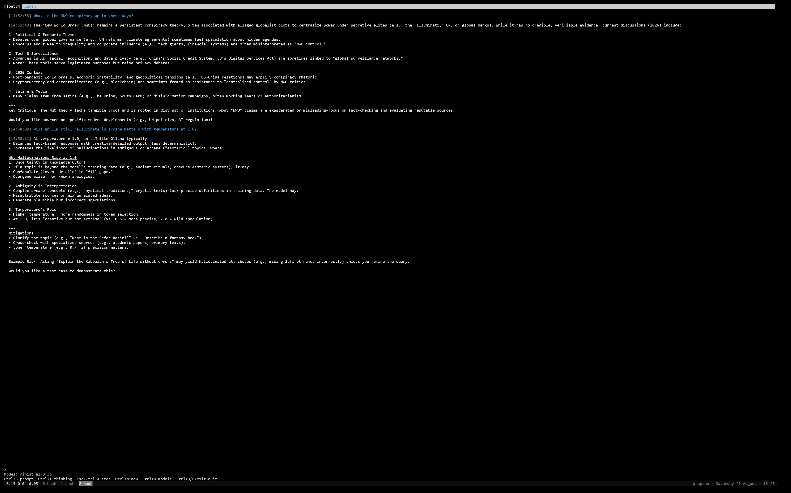

# Lumen

A pure-Python ncurses TUI for chatting with local Ollama models.



No web UI, no Electron, no heavy deps — just `curses` and `requests` talking to your local Ollama daemon.

## Install

```
pip install -r requirements.txt
pip install -e .
```

## Run

```
lumen
# or: python -m lumen
# or: python run.py
```

Pass `--host` to override the Ollama host (default `http://localhost:11434`).

## Config

Settings live in `~/.config/lumen/config.hcl` (model, temperature, max tokens, tool toggles), created on first run. System prompt lives alongside it in `systemprompt.txt`.

## Tools

The model can call `web_fetch` and `search` (DuckDuckGo via `ddgs`) when enabled in config.

## Requirements

Python 3.9+, a running Ollama instance.
